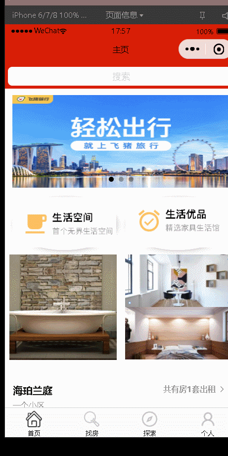
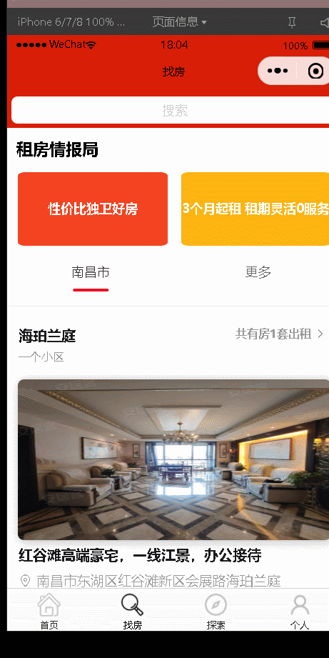
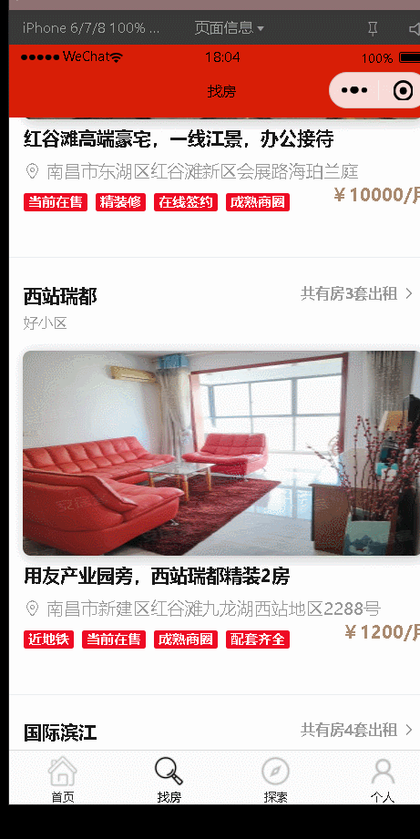
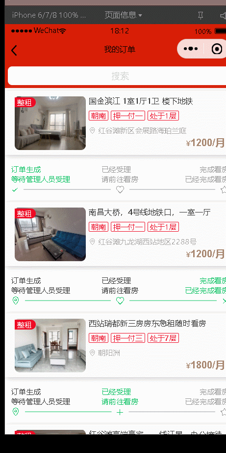
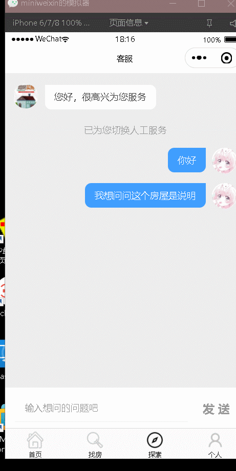

# 民宿租赁平台用户端 微信小程序

> 作者：何贤

## 前言


整个项目分为两部分：前台展示项目，以及后台管理接口。其中后台接口共60多个。涉及登陆、注册、添加地区、添加房产、购买订单、用户中心等、构成一个比较完整的流程（微信小程序非企业级无法使用支付功能。）

注：此项目纯属个人YY，不用于任何商业用途。原型借鉴了墨刀在素材广场提供的原型图。
RentalFrontEnd项目包含27个页面，涉及实时聊天、页面信息展示、地图展示导航等。写这个项目主要是练习和熟悉微信小程序和如何在微信小程序里使用websocket

> 后端项目地址： [点击这里](https://github.com/hexianWeb/RentalSystemBackend)

## 技术栈

----------

```
微信小程序
```


## 项目运行

````
git clone https://github.com/hexianWeb/RentalFrontEnd.git
cd miniweixin
npm install 
````


## 说明

> 本项目主要用于熟悉微信小程序的用法

> 如有问题请直接在Issues中提出，或加qq：2387213640

> 如果觉得对您学习有点点帮助，请右上角star一下吧 ^_^

## 页面部分截图

### 首页



### 区域找房



### 房屋详情




### 预约看房


### 地图导航


### 即时通讯



## 项目布局

--------

```
├─chat			聊天页面
├─find			详细搜索页面
├─index			主页面	
├─login			登录页面
├─logs
├─my			个人中心
├─MyInfo		个人详情信息
├─register		注册页面		
├─search		搜索页面		
├─showDetail	房屋细节页面
├─showHouse		房屋展示
├─showSpect		展示订单
├─spect			订单页面
├─SpectList
```

